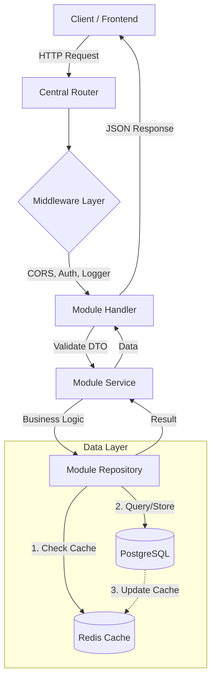

# 🚀 Go Clean Architecture Template (Gin, GORM, PostgreSQL, Redis)


Đây là một Production-Ready Template được xây dựng trên ngôn ngữ Golang, tuân thủ nguyên lý **Clean Architecture** (Modularized) nhằm tối ưu hóa khả năng mở rộng, bảo trì và hiệu năng cực cao nhờ tích hợp Redis Caching.

---

## 🏗️ Cấu Trúc Dự Án (Module-Based Architecture)

Dự án được phân chia theo từng Module chức năng, giúp tách biệt hoàn toàn phạm vi ảnh hưởng (Separation of Concerns).

```text
├── main.go                 # Điểm khởi đầu của ứng dụng
├── config/                 # Quản lý kết nối Database, Redis và biến môi trường
├── internal/               # Logic nội bộ (Core Business)
│   ├── middleware/         # Xử lý trung gian (CORS, Auth, Logger, Recovery)
│   ├── router/             # Điều hướng trung tâm, kết nối các Module
│   └── modules/            # Chứa các tính năng (Modules) của hệ thống
│       └── user/           # Ví dụ Module User
│           ├── handler/    # HTTP Layer: Tiếp nhận request, validate DTO
│           ├── service/    # UseCase Layer: Xử lý nghiệp vụ logic chính
│           ├── repository/ # Infrastructure Layer: Truy vấn PostgreSQL & Redis
│           ├── model/      # Data Layer: Định nghĩa Schema & Entity
│           └── routes.go   # Module-specific Routing
├── utils/                  # Các tiện ích dùng chung (Utilities)
├── Dockerfile              # Cấu hình Build tối ưu (Multi-stage build)
├── docker-compose.yml      # Orchestration cho toàn bộ Stack (App, DB, Redis)
└── .env                    # Cấu hình môi trường (Không commit file này)
```

---

## 🖼️ Sơ Đồ Hệ Thống (System Architecture)

Dưới đây là luồng xử lý dữ liệu chuẩn của hệ thống:



---

## ⚡ Cơ Chế Hoạt Động Của Redis (Performance Optimization)

Hệ thống áp dụng chiến lược **Cache-Aside Pattern** để đạt tốc độ đọc dữ liệu tức thì (Micro-seconds).

### 🔍 Quy trình Đọc (Read Flow)
1. **Request** gọi vào `Repository`.
2. Kiểm tra dữ liệu trong **Redis**:
   - **Cache Hit:** Trả về dữ liệu ngay lập tức từ RAM.
   - **Cache Miss:** Truy vấn xuống **PostgreSQL**, sau đó lưu kết quả vào Redis (với TTL) rồi mới trả về.

### 💾 Quy trình Ghi (Write Flow)
1. Dữ liệu được ghi thẳng vào **PostgreSQL** (Source of Truth).
2. Tự động **Invalidate/Update** cache tương ứng trong Redis (Xoá cache cũ hoặc cập nhật mới).
3. Đảm bảo tính nhất quán (Consistency) giữa Database và Cache.

---

## 🛠️ Công Nghệ & Tính Năng Key

- **Gin Gonic:** HTTP Web Framework hiệu năng cao nhất hiện nay.
- **GORM:** ORM mạnh mẽ với tính năng **Auto-Migration** (Tự động tạo bảng).
- **PostgreSQL 17:** Cơ sở dữ liệu quan hệ ổn định và mạnh mẽ.
- **Redis 8.0:** Hệ thống lưu trữ key-value trên RAM để caching cực nhanh.
- **Docker-Compose:** Triển khai toàn bộ môi trường chỉ với 1 câu lệnh.
- **CORS Middleware:** Cấu hình linh hoạt nguồn truy cập từ Frontend.

---

## 🚀 Hướng Dẫn Khởi Chạy Nhanh

### 1. Yêu cầu
- Docker & Docker Compose (Khuyên dùng)
- Hoặc Go 1.25+ & PostgreSQL/Redis cục bộ.

### 2. Cấu hình .env
Tạo file `.env` tại thư mục gốc:
```env
# Database
DB_HOST=db
DB_PORT=5431
DB_USER=postgres
DB_PASSWORD=123456
DB_NAME=postgres

# Redis
REDIS_HOST=redis
REDIS_PORT=6378

# App
ALLOWED_ORIGINS=http://localhost:3000,http://localhost:5173
```

### 3. Triển khai với Docker (Cách nhanh nhất)
```bash
# Khởi chạy toàn bộ hệ thống
docker-compose up -d --build

# Xem log ứng dụng
docker-compose logs -f app
```
Ứng dụng sẽ chạy tại: `http://localhost:8080/api/v1`

---

## 🧪 Kiểm Tra API (Endpoints)

| Method | Endpoint | Description |
| :--- | :--- | :--- |
| `POST` | `/api/v1/users/register` | Đăng ký User mới (Tự cập nhật Cache) |
| `GET` | `/api/v1/users/` | Lấy danh sách toàn bộ User (Ưu tiên Redis) |
| `GET` | `/api/v1/users/:id` | Lấy User theo ID (Ưu tiên Redis) |

---

## 📐 Nguyên Tắc Phát Triển

1. **Interface Driven:** Các lớp Service và Repository giao tiếp qua Interface để dễ dàng viết Mock Test.
2. **One-Way Dependency:** Module ngoài không được phép can thiệp trực tiếp vào logic nội bộ của module khác.
3. **Consistency:** Mọi thay đổi dữ liệu phải đảm bảo làm mới Cache Redis.

---

## ⚖️ Ưu và Nhược Điểm (Pros & Cons)

### ✅ Ưu điểm (Pros)
- **Hiệu năng vượt trội:** Nhờ Redis Cache, tốc độ truy xuất dữ liệu giảm từ hàng chục ms xuống còn < 1ms.
- **Tính đóng gói (Encapsulation):** Cấu trúc Modular giúp bạn dễ dàng thêm/sửa tính năng mà không làm ảnh hưởng đến các phần khác.
- **Dễ Unit Test:** Sử dụng Interface cho phép Mock dữ liệu cực kỳ đơn giản.
- **Sẵn sàng triển khai:** Tích hợp sẵn Docker-Compose giúp setup môi trường nhanh chóng và nhất quán.
- **Clean Code:** Tuân thủ các nguyên lý thiết kế giúp mã nguồn rõ ràng, dễ đọc cho cả người mới.

### ❌ Nhược điểm (Cons)
- **Boilerplate:** Cấu trúc nhiều lớp có thể hơi rườm rà đối với các project cực nhỏ hoặc script đơn giản.
- **Độ dốc học tập:** Yêu cầu lập trình viên hiểu biết về Interface, Dependency Injection và nguyên lý Clean Architecture.

---

## 📝 Ghi Chú
- Hệ thống đã được thiết lập Network riêng (`go_template`) trong Docker để các container liên lạc bảo mật.
- Port nội bộ và Port mapping đã được tuỳ chỉnh để tránh xung đột với các ứng dụng khác trên máy (DB: 5431, Redis: 6378).

---
*Phát triển bởi [NhatHaoDev] - Chúc bạn có những sản phẩm tuyệt vời!*
